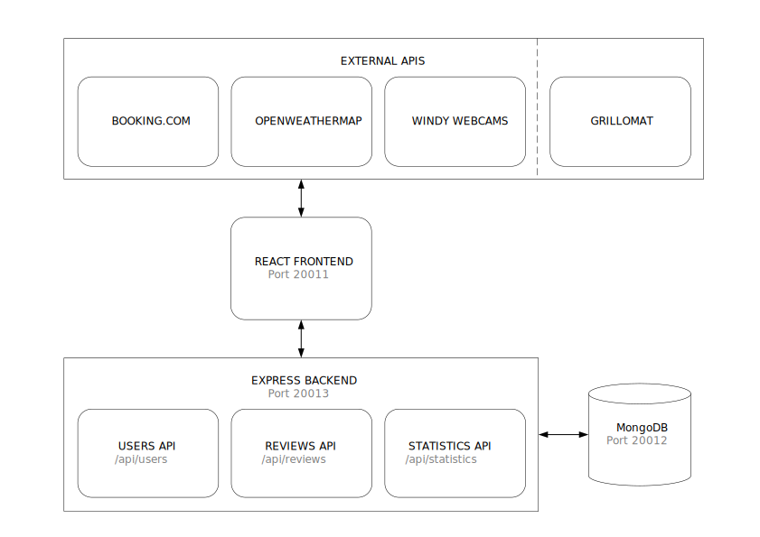
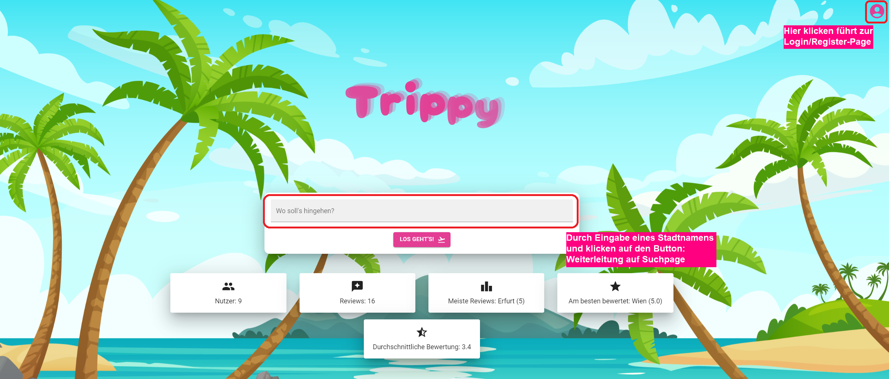
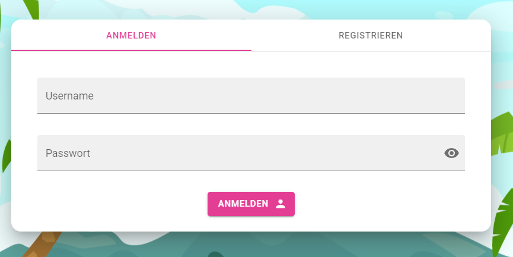
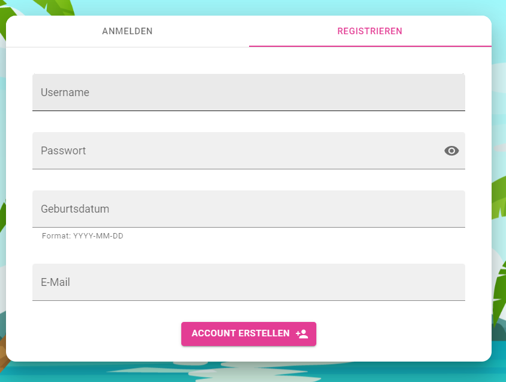
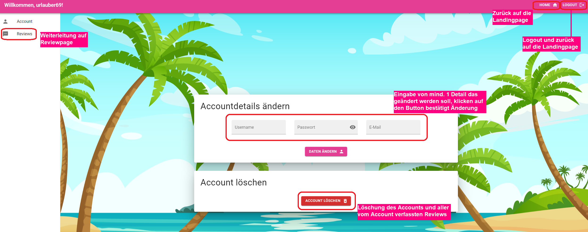
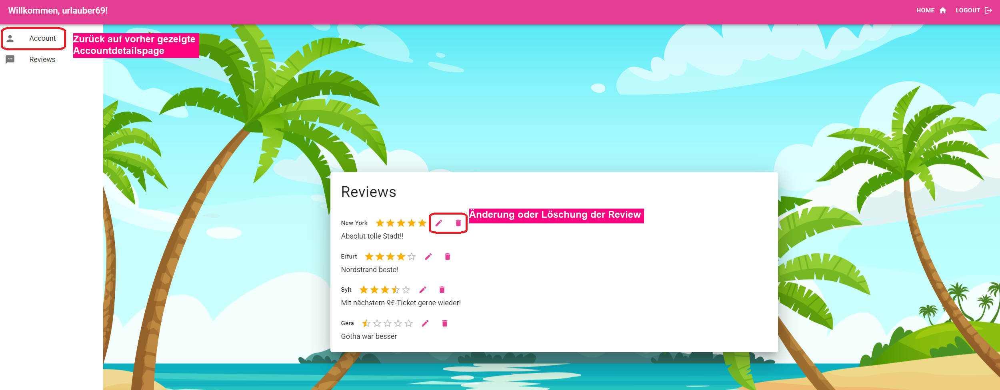
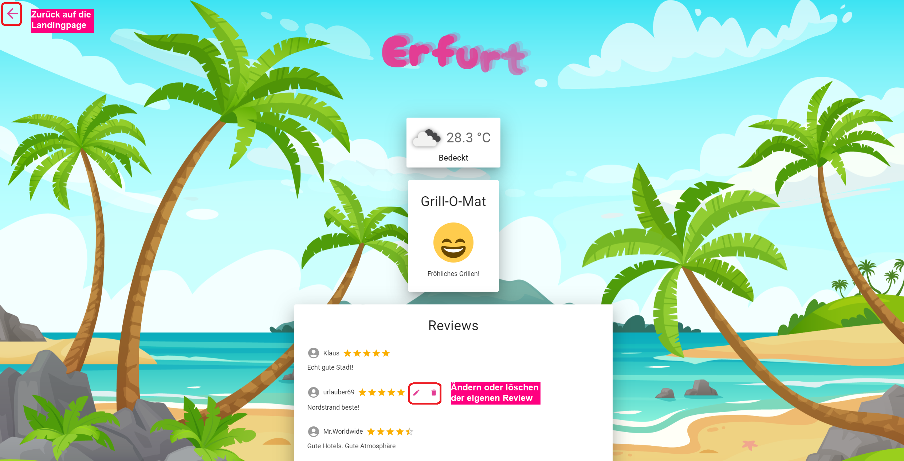
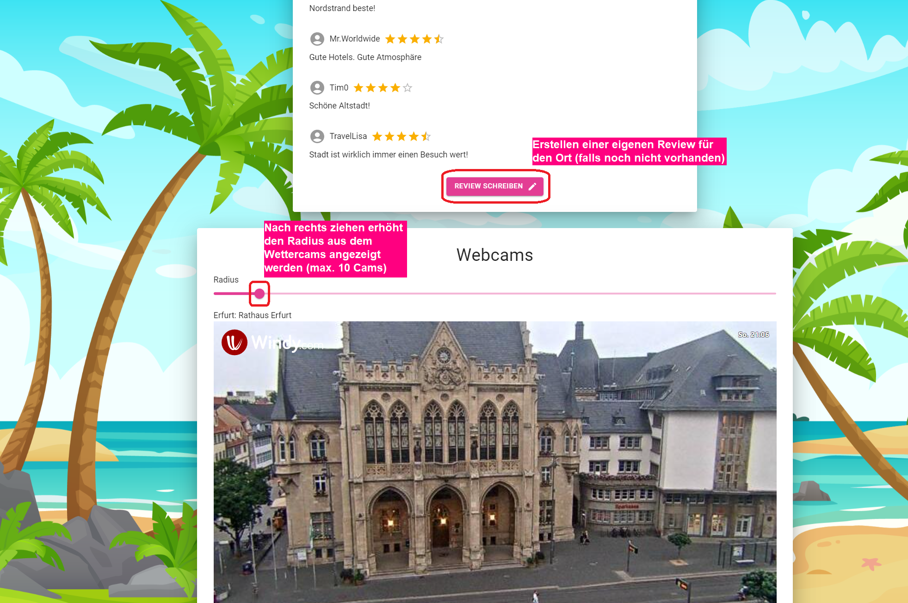
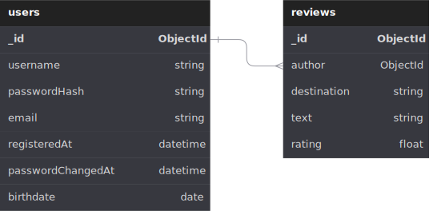

# 🏝️ Trippy - Dokumentation 🛩️

## Architektur



## Anwenderdokumentation

Alle Accounts besitzen das Passowrt `test`.<br>
Sie können sich also z.B. mit dem Username `urlauber69` und Passwort `test` anmelden oder einen neuen Nutzer anlegen.

### Landingpage

Die Landingpage der Website lässt dem Benutzer beim ersten Aufrufen in 2 Richtungen navigieren wie hier im Bild gezeigt:



### Login/Register-Page

In der Mitte der Seite wird nun eine Standart Login-Karte angezeigt



Durchs klicken auf "Registrieren" ändert sich die Karte zu einer Register Karte



**Hinweis:** Falsche Angaben in beiden Karten werden mit roten Pop-Ups in der linken unteren Ecke mit informierenden Text angezeigt. Bei passenden Eingaben wird man mit grünem Pop-Up zurück auf die Landingpage geschickt und der Button in der rechten oberen Ecke führt nun zur **Accountdetailspage**


### Accountdetailspage

Diese Seite bietet dem Nutzer die Möglichkeit ihren Account zu bearbeiten, zu löschen oder sich einfach nur auszuloggen



**Hinweis zur Accountdetailsänderung:** Auch hier wieder Unterstützung durch Fehler-Pop-Ups, bei erfolgreicher Änbderung wird die Seite neu geladen

### Reviewpage

Hier findet der User alle von ihm erstelle Reviews ansehen, diese bearbeiten und auch löschen 



### Suchpage

Durch das eingeben eines Ortes auf der **Landingpage** gelangt man auf die Seite des Ortes. Hier ist es den Usern möglich, andere Reviews zu dem Ort zu sehen und wenn sie eingeloggt sind auch selbst eine Review zu dem Ort zu schreiben oder ihre bereits geschriebene Review anzupassen.




## Entwicklerdokumentation

### Frontend

Das Frontend besteht aus mehreren Seiten, die durch einen `BrowserRouter` (in `App.jsx`) eingebunden sind.

Die folgenden Dateien finden sich im `/src/pages` Verzeichnis.

* **Home.jsx** (`/`)

    Die Landingpage der Website. Beinhaltet eine Suchleiste für Reiseziele und Navigation zur Login-/Profilseite.

    Die Seite fragt mittels `fetchUserDetails` die Login-Informationen ab.

    Eingebundene Komponenten:
    * `BackgroundImage`
    * `WavyTitle`
    * `Statistics`<br><br>

* **Account.jsx** (`/account`)

    Auf dieser Seite befinden sich Formulare zur Anmeldung und Registrierung.

    Eingebundene Komponenten:
    * `BackgroundImage`
    * `WavyTitle`
    * `LoginTab`
    * `RegisterTab`<br><br>

* **Profile.jsx** (`/profile`)

    Diese Seite besitzt ein Drawer-Menu um Unterseiten aufzurufen und ermöglicht es einem angemeldeten Nutzer:

    1. **AccountDetails.jsx**

        ... seine Accountdetails (Username, Email, Passwort) zu verändern.

        Eingebundene Komponenten:
        * `EditDetailsCard`
        * `DeleteAccountCard`<br><br>

    2. **Reviews.jsx**

        ... alle seine abgegebenen Reviews zu sehen, bearbeiten und zu löschen.

        Die Seite fragt mittels `fetchReviewsData` alle Reviews des eingeloggten Nutzers ab.
        Die Funktion `handleDialogSubmit` wird verwendet um Reviews zu aktualisieren nachdem der Dialog bestätigt wurde. Dieser wird durch die `editReview` Funktion geöffnet.
        Die `deleteReview` Funktion löscht das gewählte Review.

        Eingebundene Komponenten:
        * `ReviewDialog`<br><br>

    Des Weiteren kann der Nutzer über die Topbar zurück zur Startseite gelangen oder sich ausloggen.

    Die Seite fragt mittels `fetchUserDetails` die Login-Informationen ab.

    Eingebundene Komponenten:
    * `BackgroundImage`
    * `AccountDetails`
    * `Reviews`<br><br>

* **Search.jsx** (`/search`)

    Auf dieser Seite werden die Suchergebnisse zum gegebenen Reiseziel angezeigt:

    1. **Wetter**

        Eine Beschreibung des aktuellen Wetters und die Temperatur.

    2. **Grill-O-Mat**

        Zeigt an, ob am Reiseziel gerade gegrillt werden kann.<br>
        API bereitgestellt von Team _AuroraTwo_.

    3. **Reviews**

        Eine Liste von Reviews, die von Nutzern zu diesem Reiseziel eingereicht wurden.

    4. **Webcams**

        Eine Liste von Webcams in einem einstellbaren Radius um das Reiseziel herum. (Maximum: 10)

    5. **Hotels**

        Eine Liste von Hotels im Reiseziel, inklusive Adresse und Bewertungen von Booking.com.

    Die Seite fragt mittels `fetchUserDetails` die Login-Informationen ab.
    Durch `fetchLocationDetails` wird das Reiseziel validiert und Informationen beschafft, die für die oben genannten Dinge benötigt werden, wie z.B. Koordinaten.

    Eingebundene Komponenten:
    * `BackgroundImage`
    * `WeatherCard`
    * `GrillomatCard`
    * `HotelsCard`
    * `WebcamsCard`
    * `ReviewsCard`
    * `WavyTitle`<br><br>

* **NoPage.jsx** (Error 404)

    Diese Seite wird angezeigt, sobald keine andere Seite zur aufgerufenen URL passt. Der Nutzer kann über den Home Button wieder zurück zur Startseite gelangen.

### React-Komponenten

* **BackgroundImage**

    Das Hintergrundbild der meisten Websites. Das Bild ist abhängig von der lokalen Uhrzeit.

* **WavyTitle**

    Animierte Überschrift, wie sie auf der Startseite zu sehen ist.

* **ReviewDialog**

    Ein Dialog, der es ermöglicht, ein Rating und einen Kommentar einzugeben und abzuschicken.

* **LoginTab**
  
    Das Login-Formular. Nutzername und Passwort können eingegeben werden.<br>
    Die Funktion `login` sendet die Daten an den entsprechenden Endpunkt der Users API.

* **RegisterTab**
  
    Das Registrierungs-Formular. Nutzername, Passwort, E-Mail und das Geburtsdatum können eingegeben werden.<br>
    Die Funktion `register` sendet die Daten an den entsprechenden Endpunkt der Users API.

* **DeleteAccountCard**
  
    Beinhaltet einen "Account löschen"-Button. Die Funktion `deleteAccount` sendet eine `DELETE` Request an den entsprechenden Endpunkt der Users API.

* **EditDetailsCard**

    Beinhaltet drei Textfelder, die genutzt werden können, um Nutzername, Passwort oder E-Mail des Accounts zu ändern. Die Funktion `change` sendet die Daten an den entsprechenden Endpunkt der Users API.

* **Statistics**

    Zeigt verschiedenste Statistiken über die Nutzer und Reviews an. Die Funktion `fetchSiteStatistics` ruft alle Statistiken der Statistics API ab.

* **HotelsCard**

    Zeigt Daten zu gefundenen Hotels zum Reiseziel an. Die Funktion `fetchHotelData` ruft diese Daten von der Booking.com API ab.

* **ReviewsCard**

    Zeigt alle Reviews zum Reiseziel an. Die Funktion `fetchReviewsData` ruft alle Reviews zum Reiseziel von der Reviews API ab. Falls der Nutzer eingeloggt ist und selbst ein Review zum Reiseziel hinterlegt hat, kann er es bearbeiten (`handleDialogSubmitEdit`) und/oder löschen (`deleteReview`). Er hat auch die Möglichkeit, ein Review zu erstellen (`handleDialogSubmitCreate`).

    Eingebundene Komponenten:
    * ReviewDialog<br><br>
  
* **WeatherCard**

    Zeigt Wetterinformationen zum Reiseziel an. Die Funktion `fetchWeatherData` ruft diese Informationen von der OpenWeatherMap API ab.

* **GrillomatCard**

    Die Funktion `fetchGrillomatData` ruft Informationen von der Grillomat API vom Team AuroraTwo ab und zeigt dann mit Hilfe eines Smileys an, ob am Ziel gegrillt werden kann oder nicht.

* **WebcamsCard**

    Zeigt Webcams in und um das Reiseziel herum an. Der Suchradius ist durch einen Slider anpassbar. Die Funktion `fetchWebcamData` ruft die Informationen zu den Webcams von Windy ab.

    Eingebundene Komponenten:
    * WindyWebcam<br><br>

* **WindyWebcam**

    Zeigt den Player für eine Windy Webcam an.

### Backend

Das Backend setzt sich aus drei verschiedenen APIs zusammen.
* Users API mit dem Endpunkt `/api/users/`
* Reviews API mit dem Endpunkt `/api/reviews/`
* Statistics API mit dem Endpunkt `/api/statistics/`

Die Routen sind in den jeweiligen Dateien in `/src/routes/` definiert.

Die Schnittstellen laufen über eine einzige Express-App auf dem Port `20013`.<br>
Es wird eine Verbindung zu MongoDB über `Mongoose` hergestellt.<br>
Unter der Adresse `/api-docs` wird eine Swagger Dokumentation bzgl. der oben genannten APIs bereitgestellt, die die Endpunkte im Detail beschreibt.

Es werden zwei Models in `/src/models/` definiert.

1. **User**

    ```js
    {
        username: String,
        passwordHash: String,
        email: String,
        registeredAt: Date,
        passwordChangedAt: Date,
        birthdate: Date
    }
    ```

2. **Review**

    ```js
    {
        author: {
            type: mongoose.SchemaTypes.ObjectId,
            ref: "User"
        },
        destination: String,
        text: String,
        rating: {
            type: Number,
            min: 0.5,
            max: 5
        }
    }
    ```

Des Weiteren befindet sich im `/src/utils/` Verzeichnis die Datei `response_utils.js`, welche Standardresponses für die APIs festlegt:

1. **responseSuccess** (Status: `200 OK`)

    ```json
    {
        "status": 200,
        "data": {
            "message": "Success",
            "result": ...
        }
    }
    ```

2. **responseBadInput** (Status: `400 Bad Request`)

    ```json
    {
        "status": 400,
        "data": {
            "message": "Bad input",
            "result": ...
        }
    }
    ```

3. **responseUnauthorized** (Status: `401 Unauthorized`)

    ```json
    {
        "status": 401,
        "data": {
            "message": "You are currently not logged in"
        }
    }
    ```

4. **responseForbidden** (Status: `403 Forbidden`)

    ```json
    {
        "status": 403,
        "data": {
            "message": "You are not allowed to do that"
        }
    }
    ```

5. **responseInternalError** (Status: `500 Internal Server Error`)

    ```json
    {
        "status": 500,
        "data": {
            "message": "Internal server error",
            "result": ...
        }
    }
    ```

6. **responseOnline** (für "Wurzel"-Endpunkte der APIs, z.B. `/api/users`)

    ```json
    {
        "status": 200,
        "data": {
            "message": "Success",
            "result": "API online. Visit /api-docs for endpoint documentation."
        }
    }
    ```

## Arbeitsteilung

### Kevin

1. Reviews-API + Swagger-Doku
2. Statistics-API + Swagger-Doku
3. Landingpage Frontend
4. Suchpage Frontend
5. Datenbankanbindung
6. Dockerization

### Niklas

1. Users-API + Swagger-Doku
2. Login/Register Frontent
3. Accountdetails Frontent
4. Erstellung der Testdaten

## Datenbankschema

Die Datenbank besteht aus zwei Collections, `users` und `reviews`.<br>
`reviews` steht über das Feld `author` in einer 1:N Beziehung mit `users`, wobei `reviews` von `users` abhängig ist.



### Erklärung der Felder:

**users**

| Feld                | Beschreibung                             |
|---------------------|------------------------------------------|
| username            | Nutzername                               |
| passwordHash        | SHA-256 gehashtes Passwort               |
| email               | E-Mail Adresse                           |
| registeredAt        | Zeitstempel der Registrierung            |
| passwordChangedAt   | Zeitstempel der letzten Passwortänderung |
| birthdate           | Geburtsdatum                             |

**reviews**

| Feld                | Beschreibung                                                      |
|---------------------|-------------------------------------------------------------------|
| author              | Autor des Reviews, Referenz auf `users._id`                       |
| destination         | Reiseziel, für das das Review eingereicht wurde                   |
| text                | Review Kommentar                                                  |
| rating              | Bewertung auf einer Skala von 0.5 - 5 (halbe Sterne sind möglich) |

## Verwendete APIs

### [Booking.com](https://rapidapi.com/tipsters/api/booking-com) (über RapidAPI)

Die API von Booking.com wird für zwei Dinge verwendet.

1. `/v1/hotels/locations`
    
    Suchen eines/r Orts/Stadt/Lands/Gebiets. Die zurückgegebenen `dest_id` und `dest_type` werden für den zweiten Endpunkt dieser API verwendet und das Feld `name` wird genutzt um die Nutzereingabe des Reiseziels zu validieren.<br>
    Des Weiteren gibt die API geographische Koordinaten (Felder `lat` und `lon`) zurück, die dann für **OpenWeatherMap** und **Windy Webcams** verwendet werden.

2. `/v1/hotels/search`

    Suchen von Hotels im gegebenen Reiseziel, angegeben durch `dest_id` und `dest_type`.<br>
    Die zurückgegebenen Hotels werden mit folgenden Feldern auf der Website angezeigt:
    * `hotel_name`
    * `max_1440_photo_url`
    * `address`
    * `zip`
    * `city`
    * `district`
    * `review_score`
    * `review_score_word`
    * `review_nr`

### [OpenWeatherMap](https://openweathermap.org/current)

Diese API wird verwendet um das Wetter am Reiseziel anzeigen zu können.<br>
Die folgenden Parameter werden für eine `GET` Anfrage an `https://api.openweathermap.org/data/2.5/weather` verwendet:
* `lat`: Breitengrad
* `lon`: Längengrad
* `units=metric`: Es sollen metrische Einheiten verwendet werden (°C)
* `lang=de`: Wetterbeschreibungen sollen deutsch zurückgegeben werden
* `appid`: Der API-Key

Nach der Antwort der API werden die Temperatur (`temp`) und das Wetter (`description` und zugehöriges `icon`) auf der Website angezeigt.

### [Windy Webcams](https://api.windy.com/webcams/docs)

Diese API wird genutzt um Webcams in der Nähe des Reiseziels anzuzeigen und so dem Nutzer Live-Bilder von dort zu liefern.<br>
Es wird eine `GET` Anfrage an `https://api.windy.com/api/webcams/v2/list/nearby` gesendet.<br>
Die Syntax für diesen Endpunkt lautet `/api/webcams/v2/list/nearby={lat},{lon},{radius}`.
* `lat`: Breitengrad
* `lon`: Längengrad
* `radius`: Suchradius in Kilometern

Des Weiteren wird ein `show=webcams` Parameter angehangen, um das zurückgegebene JSON-Objekt einzugrenzen.<br>
Der API-Key wird im `x-windy-key` Header mitgeschickt.

Die Felder `title` und `id` der Antwort werden genutzt um auf der Website Player für die Webcams einzubetten.

## Installationsanleitung

Das Projekt muss geklont werden und dann muss der Befehl `docker-compose up` im Wurzelverzeichnis ausgeführt werden.

```
git clone https://git.ai.fh-erfurt.de/ma4163sp1/wa/ss23/ss_2023_wa_apwhy
cd ss_2023_wa_apwhy
docker-compose up
```